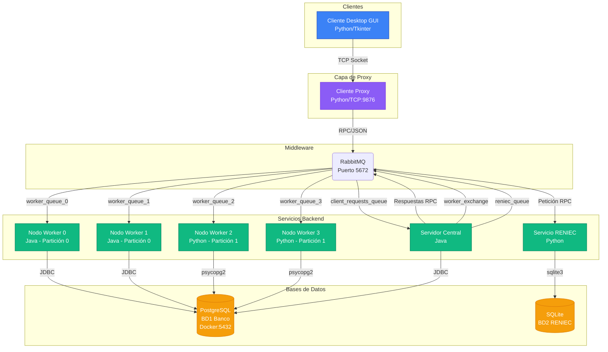

# Arquitectura del Sistema Bancario Shibasito

## Diagrama de Arquitectura Completa



## Descripción de Componentes

### Capa de Clientes

- **Cliente Desktop GUI (Python/Tkinter)**: Interfaz gráfica de usuario para operaciones bancarias
  - Login con validación DNI
  - Consulta de saldo
  - Transferencias entre cuentas
  - Solicitud de préstamos
  - Generación de códigos QR

### Capa de Proxy

- **Cliente Proxy (Python/TCP:9876)**: Intermediario entre GUI y RabbitMQ
  - Resuelve conflicto de threading entre pika y tkinter
  - Transforma mensajes de formato GUI a formato backend
  - Maneja conexiones TCP desde la GUI
  - Reenvía peticiones RPC a RabbitMQ

### Middleware

- **RabbitMQ**: Sistema de mensajería asíncrona
  - Cola `client_requests_queue`: Peticiones de clientes
  - Exchange `worker_exchange`: Distribución a workers
  - Cola `reniec_queue`: Validaciones de identidad
  - Colas `worker_queue_0` a `worker_queue_3`: Workers específicos

### Servicios Backend

- **Servidor Central (Java)**: Coordinador principal

  - Enruta peticiones a particiones correctas
  - Coordina protocolo 2PC para transferencias
  - Valida credenciales con RENIEC
  - Gestiona préstamos

- **Nodos Worker (Java/Python)**: Procesadores de datos particionados

  - **Partición 0**: Nodos 0 y 1 (Java) - Cuentas pares
  - **Partición 1**: Nodos 2 y 3 (Python) - Cuentas impares
  - Ejecutan operaciones CRUD sobre cuentas
  - Participan en protocolo 2PC

- **Servicio RENIEC (Python)**: Validador de identidad
  - Verifica DNI contra base de datos RENIEC
  - Retorna datos personales completos

### Bases de Datos

- **PostgreSQL (Docker)**: Base de datos principal del banco

  - Tabla `Cuentas`: Información de cuentas bancarias
  - Tabla `Transacciones`: Historial de operaciones
  - Tabla `Prestamos`: Préstamos solicitados

- **SQLite**: Base de datos de RENIEC
  - Tabla `Personas`: Datos de identidad (DNI, nombres, apellidos)

## Flujos de Comunicación

### 1. Login

```
GUI → Proxy (TCP) → RabbitMQ → Servidor Central → RENIEC → PostgreSQL
```

### 2. Consulta de Saldo

```
GUI → Proxy (TCP) → RabbitMQ → Servidor Central → Worker (partición) → PostgreSQL
```

### 3. Transferencia (2PC)

```
GUI → Proxy → RabbitMQ → Servidor Central
  ├→ Worker A (PREPARE)
  ├→ Worker B (PREPARE)
  ├→ Worker A (COMMIT/ABORT)
  └→ Worker B (COMMIT/ABORT)
```

### 4. Solicitud de Préstamo

```
GUI → Proxy → RabbitMQ → Servidor Central → RENIEC → PostgreSQL
```

## Configuración de Puertos

| Servicio            | Puerto | Protocolo  |
| ------------------- | ------ | ---------- |
| Cliente Proxy       | 9876   | TCP        |
| RabbitMQ            | 5672   | AMQP       |
| RabbitMQ Management | 15672  | HTTP       |
| PostgreSQL          | 5432   | PostgreSQL |

## Particionamiento de Datos

- **Estrategia**: Módulo 2 sobre ID de cuenta
- **Partición 0** (Nodos 0, 1): `cuenta % 2 == 0`
- **Partición 1** (Nodos 2, 3): `cuenta % 2 == 1`

## Tecnologías Utilizadas

- **Backend**: Java 11, Python 3.12
- **Middleware**: RabbitMQ 3.x
- **Bases de Datos**: PostgreSQL 18, SQLite 3
- **GUI**: Python Tkinter
- **Librerías**: pika (Python), amqp-client (Java), psycopg2, JDBC
- **Containerización**: Docker (PostgreSQL, RabbitMQ)
